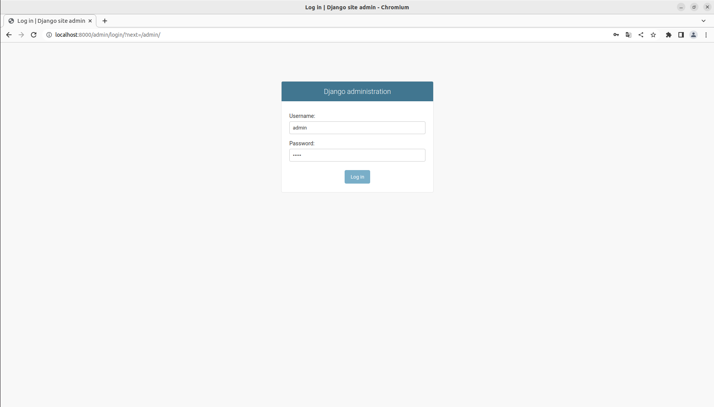
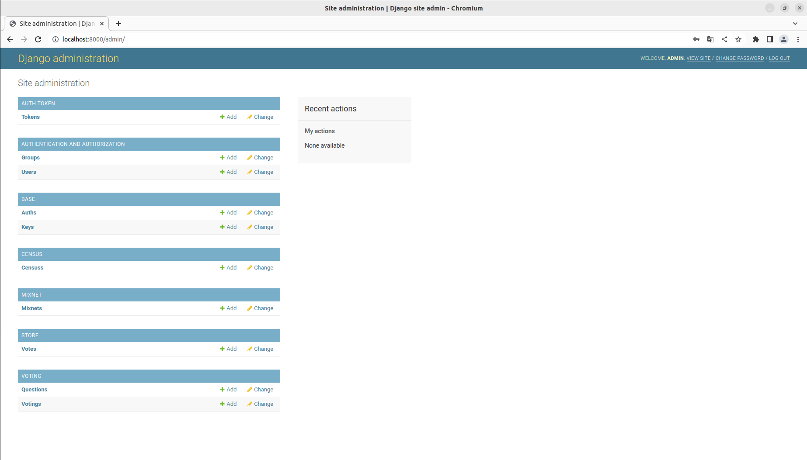
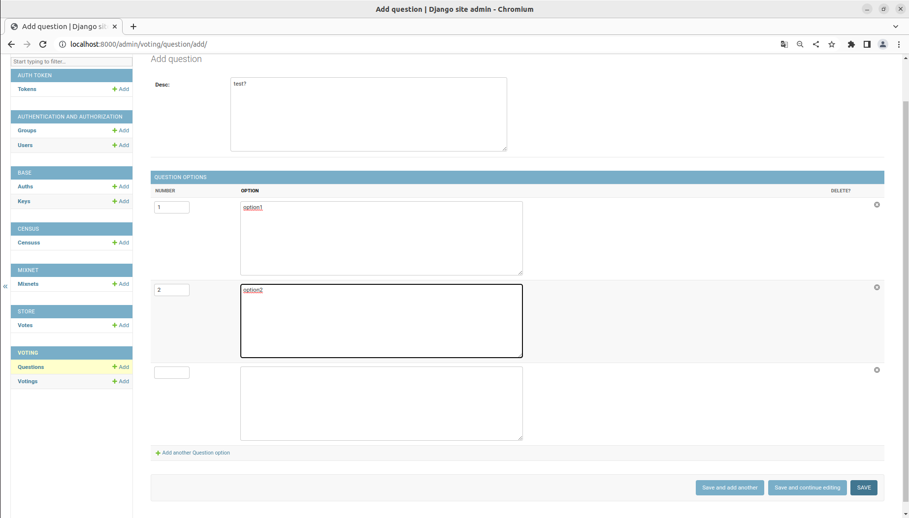
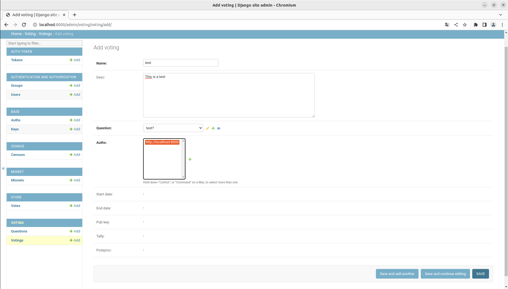
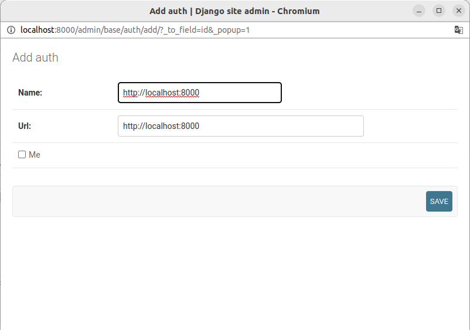
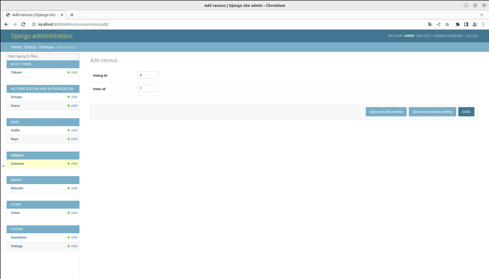
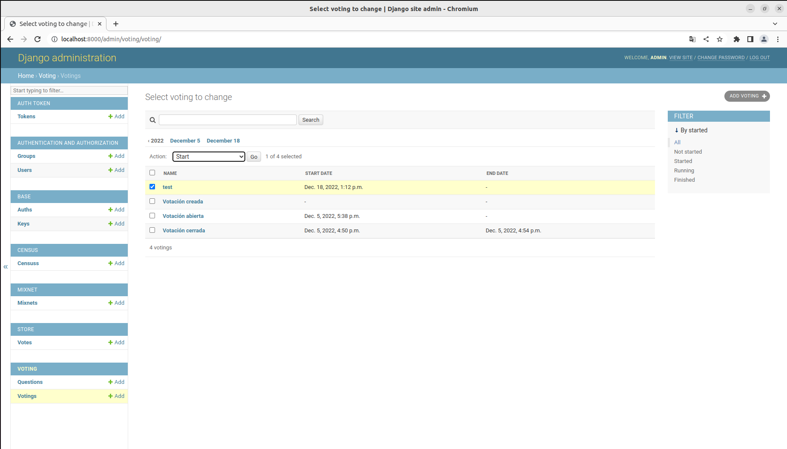
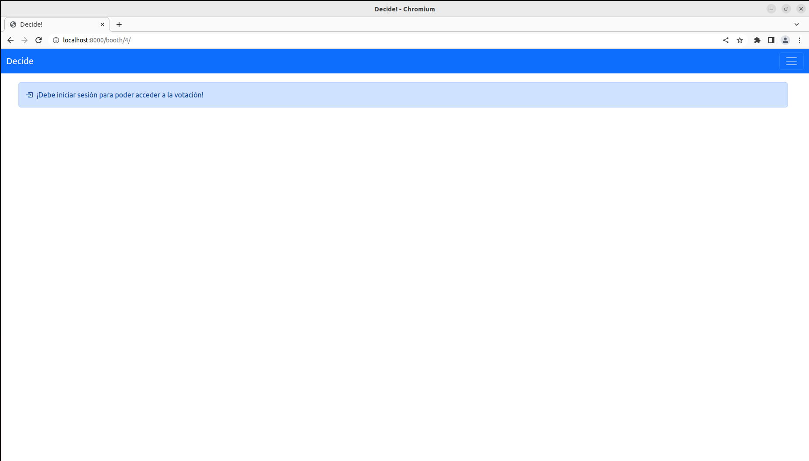
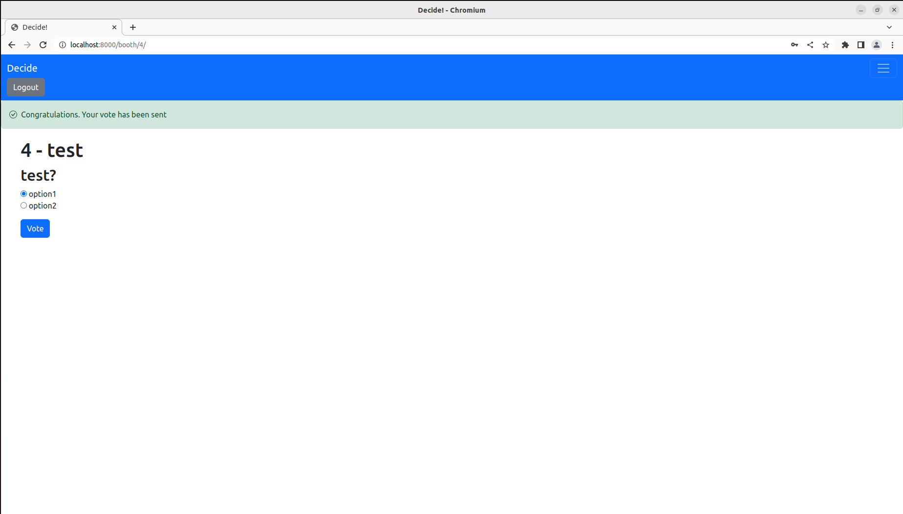
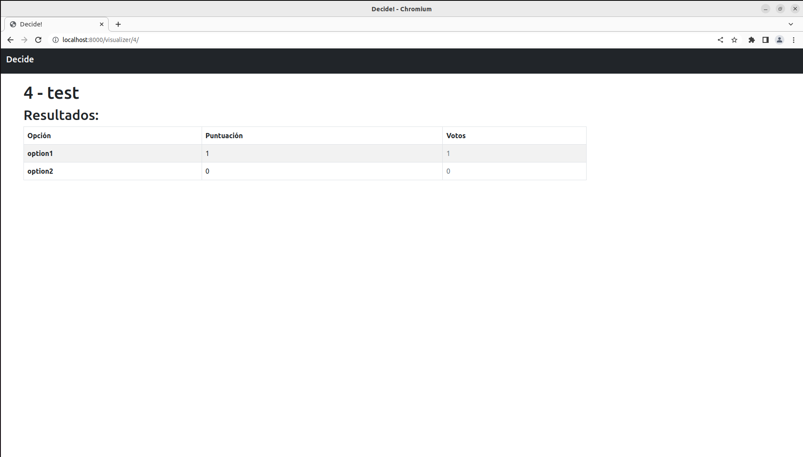

[](https://travis-ci.com/wadobo/decide) [](https://www.codacy.com/gh/decide-update-4-1/decide-update-4.1/dashboard?utm_source=github.com&amp;utm_medium=referral&amp;utm_content=decide-update-4-1/decide-update-4.1&amp;utm_campaign=Badge_Grade) [](https://www.codacy.com/gh/decide-update-4-1/decide-update-4.1/dashboard?utm_source=github.com&utm_medium=referral&utm_content=decide-update-4-1/decide-update-4.1&utm_campaign=Badge_Coverage)

Para la ejecucicio de este proyecto es necesario ejecutar este comando

*'sudo apt install python3-tk' 'sudo apt install gnome-screenshot'*

Plataforma voto electrónico educativa
=====================================

El objetivo de este proyecto es implementar una plataforma de voto
electrónico seguro, que cumpla una serie de garantías básicas, como la
anonimicidad y el secreto del voto.

Se trata de un proyecto educativo, pensado para el estudio de sistemas de
votación, por lo que prima la simplicidad por encima de la eficiencia
cuando sea posible. Por lo tanto se asumen algunas carencias para permitir
que sea entendible y extensible.


Subsistemas, apps y proyecto base
---------------------------------

El proyecto se divide en [subsistemas](doc/subsistemas.md), los cuales estarán desacoplados
entre ellos. Para conseguir esto, los subsistemas se conectarán entre si mediante API y necesitamos un proyecto base donde configurar las ruts de estas API.

Este proyecto Django estará dividido en apps (subsistemas y proyecto base), donde cualquier app podrá ser reemplazada individualmente.

Gateway
---------

Para ofrecer un punto de entrada conocido para todos los subsistemas
existe el llamado **gateway** que no es más que una ruta disponible
que redirigirá todas las peticiones al subsistema correspondiente, de
tal forma que cualquier cliente que use la API no tiene por qué saber
en qué servidor está desplegado cada subsistema.

La ruta se compone de:

    http://DOMINIO/gateway/SUBSISTEMA/RUTA/EN/EL/SUBSISTEMA

Por ejemplo para acceder al subsistema de autenticación y hacer la petición
al endpoint de /authentication/login/ deberíamos hacer la petición a la
siguiente ruta:

    http://DOMINIO/gateway/authentication/login/

Otro ejemplo sería para obtener una votación por id:

    http://DOMINIO/gateway/voting/?id=1

A nivel interno, el módulo `mods` ofrece esta funcionalidad, pero el
gateway es útil para hacer uso desde peticiones de cliente, por ejemplo
en el javascript de la cabina de votación o la visualización de resultados,
y también para módulos externos que no sean aplicaciones django.

Configurar y ejecutar el proyecto
---------------------------------

Para configurar el proyecto, podremos crearnos un fichero local_settings.py basado en el
local_settings.example.py, donde podremos configurar la ruta de nuestras apps o escoger que módulos
ejecutar.

Una vez hecho esto, será necesario instalar las dependencias del proyecto, las cuales están en el
fichero requirements.txt:

    pip install -r requirements.txt

Tras esto tendremos que crearnos nuestra base de datos con postgres:

    sudo su - postgres
    psql -c "create user decide with password 'decide'"
    psql -c "create database decide owner decide"
    psql -c "ALTER USER decide CREATEDB"

Entramos en la carpeta del proyecto (cd decide) y realizamos la primera migración para preparar la
base de datos que utilizaremos:

    ./manage.py migrate

Creamos el superusuario, que será el administrador del sistema. Con este usuario podremos tener acceso 
a todas las funcionalidades ofrecidas por Decide, como por ejemplo crear usuarios. El comando es el 
siguiente:

    ./manage.py createsuperuser

Por último, ya podremos ejecutar el módulos o módulos seleccionados en la configuración de la
siguiente manera:

    ./manage.py runserver

Tests
-------------------

Una vez configurado postgres y ejecutado el migrate.

Para ejecutar todos los tests disponibles

    $./manage.py test

Para ejecutar los tests que pertenecen a una categoria como “voting”, por ejemplo

    $./manage.py test voting

Para ver la cobertura del codigo que estos tests prueban, se puede lanzar el siguiente comando:

    coverage run --source . ./manage.py test -v 2

Esto generará un "index.html", que se puede consultar para ver de forma especifica las partes del codigo no testeadas.


Guía rápida
-------------------

Aclaración: En esta guía vamos a usar como url de base: "localhost:8000".

### 1. Login como administrador del sistema

Una vez iniciada la aplicación, accedemos a http://localhost:8000/admin/ e ingresamos las credenciales 
del super usuario creado anteriormente.



Si nos hemos conectado con éxito como un administrador, nos debería aparecer la siguiente vista:



### 2. Creación de questions

Buscamos el botón "add" dentro del apartado "questions" de la categoría "voting". En el textarea 
etiquetado como "Desc" se añade la pregunta a realizar en la futura votación. Después en los
apartados de "question options" añadimos todas las posibles respuestas a la pregunta definida 
anteriormente. Estas "questions options" se pueden eliminar clickando a la "X" situada a la derecha y
se pueden añadir mas opciones pulsando en "add questions options" situado mas abajo. 

No es necesario rellenar todas las "question options" que aparezcan en la vista. Una vez tengamos 
todas las posibles respuestas que deseamos podemos guardar haciendo click en el botón "Save".



### 3. Creación de votings

Hacemos click al botón "add" dentro de "Votings" en la categoría "Voting" y nos aparecerá el formulario
de creacion de votaciones.

En dicho formulario le ponemos un nombre a la votación, la descripción es opcional, en el desplegable
"question" nos debe aparecer la pregunta generada en el apartado anterior de esta guía y la 
seleccionamos. 



En el apartado "Auths" de su primera votación deberá crear uno. Para ello, debe clickar en el "+" a la 
derecha de la lista de "Auths". Aparecerá una ventana nueva donde deberá rellenar un formulario con el
nombre que desee y la url, en nuestro caso es "http://localhost:8000".



Pulsamos en el botón "Save" y ya tenemos nuestra votación creada.

### 4. Creacion de census

En "votings" buscamos la votación que hemos generado y entramos en ella para mirar en la barra de 
direcciones la id de nuestra votación. En el siguiente ejemplo, la id es 19.

    http://localhost:8000/admin/voting/voting/19/change/

Nos dirigimos al apartado "censuss" en la categoría "census" y clickamos en "add". Ponemos la id de 
nuestra votacion en "voting id" y en "voter id" ponemos la id del votante que queremos añadir. 

NOTA: el administrador si es el primer usuario creado tendrá la id 1.



### 5. Comenzar la votación

Llegados a este punto necesitamos abrir una votación, para ello debemos marcar el checkbox a la 
izquierda de nuestra votación. Una vez seleccionado, tenemos que ir al desplegable de "action",
seleccionamos la opción "Start" y pulsamos en el boton "Go". Esperamos a que aparezca el "Start date" 
y ya tendríamos la votación abierta y lista para votar. 



### 6. Votar

Para poder votar primero debemos ingresar en la barra de direcciones de nuestro navegador lo siguiente:

    http://localhost:8000/booth/[id de la votación]/



Una vez accedemos, debemos iniciar sesión con un usuario que esté incluido en el censo.

Cuando nos aparezca la pregunta, ya podemos seleccionar la respuesta y guardarla como un voto. 
Al confirmar el voto, nos aparecerá lo siguiente:



El mensaje de "Congratulations. Your vote has been sent" nos confirma que nuestro voto ha sido 
registrado correctamente.

### 7. Conteo de votos

Nos dirigimos nuevamente al apartado "voting" desde nuestro perfil de administrador. Primero tenemos 
que cerrar la votación, para ello seleccionamos el checkbox a la izquierda de nuestra votación
marcamos "Stop" y pulsamos el botón "Go". Notará que en el apartado "End Date" ahora aparece
la fecha actual, esto nos indica que la votación ha sido cerrada y está lista para el conteo.

Una vez cerrada la votación, volvemos a seleccionar el checkbox de la izquierda de nuestra votación
marcamos la opción "Tally" en el desplegable de "Actions" y pulsamos nuevamente en el botón "Go".


### 8. Visualización de resultado

Una vez tenemos la votación cerrada y con el conteo de votos realizado, ya podemos visualizar el
resultado accediendo a la siguiente url:

    http://localhost:8000/visualizer/[id de la votación]/



Ejecutar con docker
-------------------

Existe una configuración de docker compose que lanza 3 contenedores, uno
para el servidor de base de datos, otro para el django y otro con un
servidor web nginx para servir los ficheros estáticos y hacer de proxy al
servidor django:

 * decide\_db
 * decide\_web
 * decide\_nginx

Además se crean dos volúmenes, uno para los ficheros estáticos y medias del
proyecto y otro para la base de datos postgresql, de esta forma los
contenedores se pueden destruir sin miedo a perder datos:

 * decide\_db
 * decide\_static

Se puede editar el fichero docker-settings.py para modificar el settings
del proyecto django antes de crear las imágenes del contenedor.

Crear imágenes y lanzar contenedores:

    $ cd docker
    $ docker-compose up -d

Parar contenedores:

    $ docker-compose down

Crear un usuario administrador:

    $ docker exec -ti decide_web ./manage.py createsuperuser

Lanzar la consola django:

    $ docker exec -ti decide_web ./manage.py shell

Lanzar tests:

    $ docker exec -ti decide_web ./manage.py test

Lanzar una consola SQL:

    $ docker exec -ti decide_db ash -c "su - postgres -c 'psql postgres'"

Ejecutar con vagrant + ansible
------------------------------

Existe una configuración de vagrant que crea una máquina virtual con todo
lo necesario instalado y listo para funcionar. La configuración está en
vagrant/Vagrantfile y por defecto utiliza Virtualbox, por lo que para
que esto funcione debes tener instalado en tu sistema vagrant y Virtualbox.

Crear la máquina virtual con vagrant:

    $ cd vagrant
    $ vagrant up

Una vez creada podremos acceder a la web, con el usuario admin/admin:

http://localhost:8080/admin

Acceder por ssh a la máquina:

    $ vagrant ssh

Esto nos dará una consola con el usuario vagrant, que tiene permisos de
sudo, por lo que podremos acceder al usuario administrador con:

    $ sudo su

Parar la máquina virtual:

    $ vagrant stop

Una vez parada la máquina podemos volver a lanzarla con `vagrant up`.

Eliminar la máquina virtual:

    $ vagrant destroy

Ansible
-------

El provisionamiento de la aplicación con vagrant está hecho con Ansible,
algo que nos permite utilizarlo de forma independiente para provisionar
una instalación de Decide en uno o varios servidores remotos con un
simple comando.

    $ cd vagrant
    $ ansible-playbook -i inventory playbook.yml

Para que esto funcione debes definir un fichero [inventory](https://docs.ansible.com/ansible/latest/user_guide/intro_inventory.html)
con los servidores destino.

Los scripts de ansible están divididos en varios ficheros .yml donde
se definen las diferentes tareas, por lo que es posible lanzar partes
independientes:

  * packages.yml, dependencias del sistema
  * user.yml, creación de usuario decide
  * python.yml, git clone del repositorio e instalación de dependencias python en virtualenv
  * files.yml, ficheros de configuración, systemd, nginx y local\_settings.py
  * database.yml, creación de usuario y base de datos postgres
  * django.yml, comandos django básicos y creación de usuario admin
  * services.yml, reinicio de servicios, decide, nginx y postgres

Por ejemplo este comando sólo reinicia los servicios en el servidor:

    $ ansible-playbook -i inventory -t services

El provisionamiento de ansible está diseñado para funcionar con **ubuntu/bionic64**,
para funcionar con otras distribuciones es posible que haga falta modificar
el fichero packages.yml.

Versionado
----------

El versionado de API está hecho utilizando Django Rest Framework, y la forma
elegida para este versionado es mediante [parámetros de búsqueda](https://www.django-rest-framework.org/api-guide/versioning/#queryparameterversioning),
podemos cambiarlo a parámetros en la URL o en el nombre del HOST, hay diferentes
tipos de versionado disponibles en Django Rest Framework, podemos verlos
[aqui](https://www.django-rest-framework.org/api-guide/versioning/#versioning).

Nosotros hemos escogido el de por parámetros por ser el más sencillo, y hemos
creado un ejemplo para que veamos su uso, podemos verlo en voting/views.py

Si nosotros queremos que la salida que nos da la llamada a la API /voting/, sea
diferente en la versión 2, solo tenemos que comprobar en la versión nos está
llegando, y hacer lo que queramos, por ejemplo:


```
    def get(self, request, *args, **kwargs):
        version = request.version  # Con request.version obtenemos la versión
        if version not in settings.ALLOWED_VERSIONS:  # Versiones permitidas
            version = settings.DEFAULT_VERSION  # Si no existe: versión por defecto
        # En el caso de usar la versión 2, usamos un serializador diferente
        if version == 'v2':
            self.serializer_class = SimpleVotingSerializer
        return super().get(request, *args, **kwargs)
```

Para llamar a las diferentes versiones, haremos lo siguiente:

* /voting/?version=v1
* /voting/?version=v2


Test de estrés con Locust
-------------------------

Antes de empezar, comentaré para que sirven las pruebas de estrés. A veces necesitamos soportar que
nuestra aplicación ofrezca una cantidad de peticiones por segundo, porque habrá mucha gente entrando
a la misma vez, y ante este estrés, tenemos que comprobar como se comporta nuestra aplicación.

No es lo mismo que cuando la estresemos nos de un error 500 a que nos devuelva la petición de otro
usuario. Con estos test conseguiremos comprobar cual es ese comportamiento, y quizás mejorar la
velocidad de las peticiones para permitir más peticiones por segundo.

Para ejecutar los test de estrés utilizando locust, necesitaremos tener instalado locust:

    $ pip install locust

Una vez instalado, necesitaremos tener un fichero locustfile.py donde tengamos la configuración de
lo que vamos a ejecutar. En nuestro caso, tenemos hecho dos ejemplos:

1. Visualizer: entra en el visualizador de una votación para ver cuantas peticiones puede aguantar.

    Para ejecutar el test de Visualizer, tenemos que tener en cuenta que entra en la votación 1, por lo
    que necesitaremos tenerla creada para que funcione correctamente, una vez hecho esto, podemos
    comenzar a probar con el siguiente comando (dentro de la carpeta loadtest):

        $ locust Visualizer

    Esto abrirá un servidor que podremos ver en el navegador, el mismo comando nos dirá el puerto.
    Cuando se abra, nos preguntará cuantos usuarios queremos que hagan peticiones a la vez, y como
    queremos que vaya creciendo hasta llegar a ese número. Por ejemplo, si ponemos 100 y 5, estaremos
    creando 5 nuevos usuarios cada segundo hasta llegar a 100.

2. Voters: utilizaremos usuarios previamente creados, y haremos una secuencia de peticiones: login,
getuser y store. Sería lo que realizaría un usuario cuando va a votar, por lo que con este ejemplo
estaremos comprobando cuantas votaciones podemos hacer.


    Para ejecutar el test de Voter, necesitaremos realizar varios preparos. Necesitaremos la votación 1
    abierta, y necesitaremos crear una serie de usuarios en el censo de esta votación, para que cuando
    hagamos el test, estos usuario puedan autenticarse y votar correctamente. Para facilitar esta
    tarea, hemos creado el script de python gen_census.py, en el cual creamos los usuarios que
    tenemos dentro del fichero voters.json y los añadimos al censo utilizando la librería requests.
    Para que este script funcione, necesitaremos tener instalado request:

        $ pip install requests

    Una vez instalado, ejecutamos el script:

        $ python gen_census.py

    Tras esto, ya podremos comenzar el test de estrés de votantes:

        $ locust Voters

Importante mirar bien el fichero locustfile.py, donde existen algunas configuraciones que podremos
cambiar, dependiendo del HOST donde queramos hacer las pruebas y del id de la votación.

A tener en cuenta:

* En un servidor local, con un postgres que por defecto nos viene limitado a 100 usuarios
  concurrentes, cuando pongamos más de 100, lo normal es que empiecen a fallar muchas peticiones.
* Si hacemos las pruebas en local, donde tenemos activado el modo debug de Django, lo normal es que
  las peticiones tarden algo más y consigamos menos RPS (Peticiones por segundo).

Poblar con datos iniciales
--------------------------

Para probar el correcto funcionamiento de nuestra aplicación de decide, hemos generado una serie de
datos iniciales. Para ello, hemos elaborado un archivo JSON con datos que Django usa para generar 
varias votaciones y usuarios de manera automática. Este se ha dotado con el nombre de "populate.json"
y se ha colocado junto a "manage.py". Lo pasos a seguir son los comentados abajo.

Para borrar posibles datos en base de datos generados por el usuario, se recomienda ejecutar:

    ./manage.py flush

Tras esto, poblamos la base de datos con datos iniciales de la siguiente manera:

    ./manage.py loaddata populate.json

Se ha creado un usuario staff con las credenciales:

* Usuario: admin
* Contraseña: admin

Por otra parte, el resto de usuarios (3 restantes) siguen la siguiente secuencia:

* Usuario: usuario#
* Contraseña: practica#

donde # es la sucesión desde el valor 1 hasta el 3.

En cuanto a las votaciones, se ha creado una votación cerrada con su correspondiente conteo,
una votación abierta con la que podemos interactuar y una votación que no se ha iniciado,
cubriendo así todas las posibilidades.
Si se quieren añadir más casuística a la carga inicial, basta con editar el "populate.json" siguiendo 
la misma estructura que los datos contenidos en el mismo.


Cabe añadir que previo a ejecutar ambos comandos, deberemos haber activado nuestro entorno de 
Python 3.9.


El archivo "populate.json" se ha generado manualmente con ayuda de la documentación encontrada en
[el siguiente portal web](https://docs.djangoproject.com/en/4.1/howto/initial-data/).

Versiones actuales
------------------

En las ultimas actualizaciones se han modificado las versiones usadas por la aplicación Decide. Las 
versiones usadas actualmente se corresponden a las siguientes:

* Django = 4.1
* pycryptodome = 3.15.0
* djangorestframework = 3.14.0
* django-cors-headers = 3.13.0
* requests = 2.28.1
* django-filter = 22.1
* psycopg2 = 2.9.4
* coverage = 6.5.0
* jsonnet = 0.18.0
* django-nose = 1.4.6
* django-rest-swagger = 2.2.0
* Python = 3.9
* Vue=3
* Bootstrap=5.2
* selenium = 4.7.2
